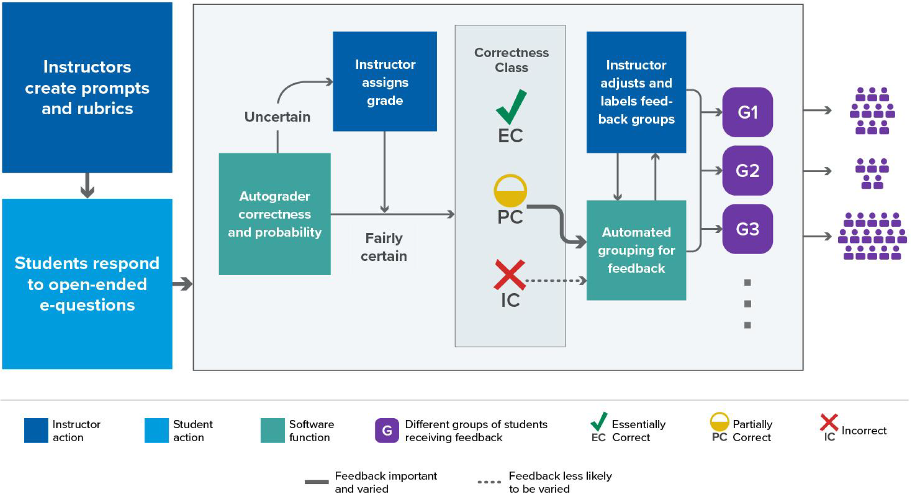
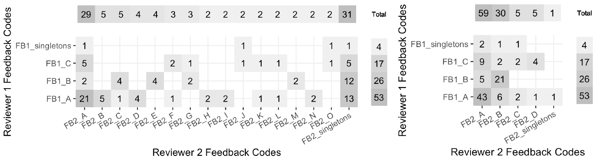
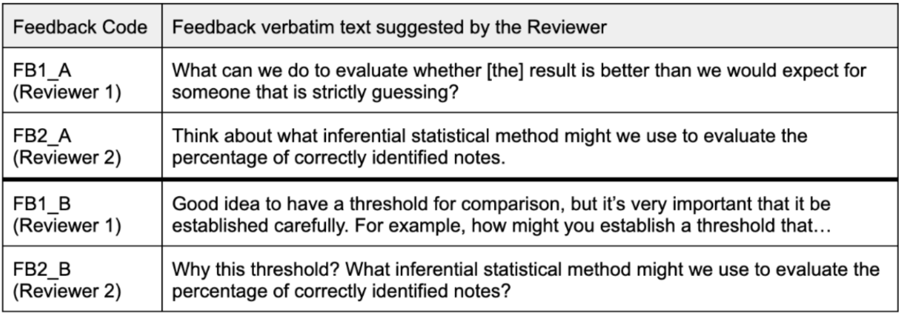
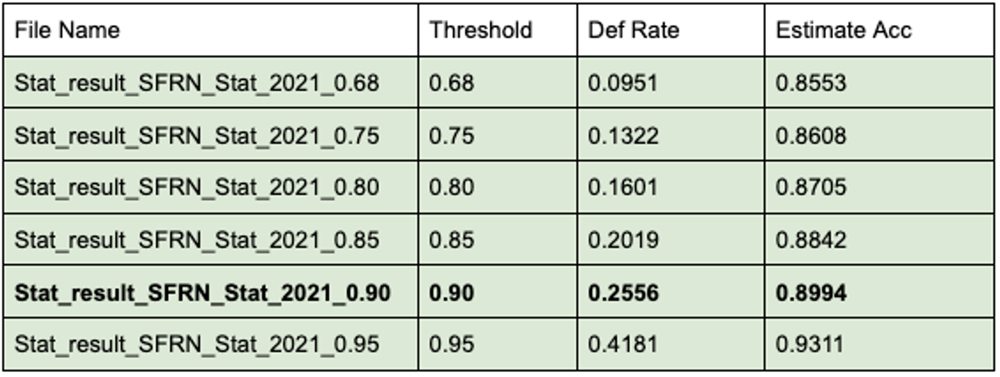
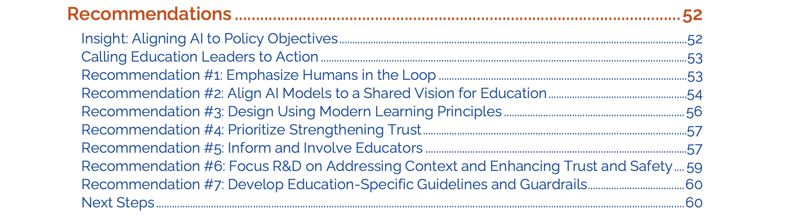

```{r setup, include=FALSE}
knitr::opts_chunk$set(echo = FALSE)

library(tidyverse)
# library(kableExtra)

```


---

\titlepage

#### Two question survey before seminar (scan with mobile phone) 
{width=20%}


<!-- Discuss Michael Bulmer influence while folks complete this -->

# Responses to our survey?

1. Is your lucky/favorite number odd or even?
2. How did you describe the value of formative assessment?
    - [Odd] Free text response: *write anything you like*
    - [Even] Selected response: *endorse provided options*


# Motivation

- "Write-to-learn" tasks improve learning outcomes (Graham, et al., 2020)
- Critical for citizen-statisticians to communicate effectively (Gould, 2010)
- Frequent practice w/ communicating improves statistical literacy and promotes retention (Basu, et al., 2013)
- Formative assessment benefits both students & instructors (Black & Wiliam, 2009; GAISE, 2016; Pearl, et al., 2012)
- A majority of U.S. undergraduates at public institutions take at least one large-enrollment STEM course (Supiano, 2022)
- *Logistics* of constructed response tasks jeopardize use in large-enrollment classes (Garfield & Ben-Zvi, 2008; Woodard & McGowan, 2012)

# Easy!

{ width=95% }

# Erm... 

{ width=95% }

<!-- # Policy Report (May 2023) -->


# Goal state

*Computer-assisted formative assessment feedback for short-answer tasks in large-enrollment classes, such that instructor burden is similar to small class (~30 students)*

{width=40%}

<!-- Note: Automate the "copy / paste" workflow -->
<!-- Note: How good does the machine have to be?? -->
<!-- Note: as a statistician, I'm always comparing current circumstances of my data to some ideal state (SRS or randomized experiment) and negotiating compromise to achieve most desirable outcomes possible given the circumstances available. It's the same here--we want to create useful FA where there is (almost) none-->


# Collaborators (humans)


# Tools (machines)

- Natural language processing (NLP) involves how computers can be programmed to analyze language elements
- NLP-assisted feedback for educational use:
    - automated short-answer grading (ASAG) from 2009
    - essays & long-answer tasks earlier
- Human-machine collaboration is a promising mechanism to assist rapid, individualized feedback at scale (Basu, 2013)
- Deep neural networks application since 2016
- Semantic Feature-Wise Transformation Relation Network (SFRN; Li, Tomar, & Passonneau, 2021)
    - back-translation data augmentation (French & Chinese)
    - can accommodate rubrics, expert solutions, or both


# SFRN Detail (Li et al., 2021)

\small

SFRN is an end-to-end model with 3 components:

1. encode QRA triples producing vector representations for question (Q), a possible reference (R), and student answer (A)
2. when relation network includes multiple QRA triples, a learned feature-wise transformation network merges all relation vectors for a student answer into a single relation vector by leveraging attentions calculated by a QRA triple;
3. the resulting vector representation is passed as an input to a classifier (i.e., neural network) 

![The $g_{\theta}MLP$ function computes the relation vector for each [Q,R,A] triple. A
set of relation vectors is combined (+) using *SFT*. The $f_{\phi}MLP$ function is the assessment classifier.](SFRN.png){width=70%}


# Project Schematic

{width=90%}

\vskip 12 pt

\small
*Goal: Computer-assisted formative assessment feedback for short-answer tasks in large-enrollment classes, such that instructor burden is similar to small class (~30 students)*

<!-- Note: Automate the "copy / paste" workflow -->
<!-- Note: How good does the machine have to be?? -->
<!-- Note: as a statistician, I'm always comparing current circumstances of my data to some ideal state (SRS or randomized experiment) and negotiating compromise to achieve most desirable outcomes possible given the circumstances available. It's the same here--we want to create useful FA where there is (almost) none-->

# Research Questions

>- **RQ3**: What sort of NLP representation leads to good clustering performance, and how does that interact with the classification algorithm?  

>- **RQ2**: What level of agreement is achieved between human raters and an NLP algorithm?  

>- **RQ1**: What level of agreement is achieved among trained human raters labeling (i.e., scoring) short-answer tasks?  


\vskip 18pt

### Short Paper (ICOTS)

\footnotesize

Lloyd, S. E., Beckman, M., Pearl, D., Passonneau, R., Li, Z., & Wang, Z. (2022). Foundations for AI-Assisted Formative Assessment Feedback for Short-Answer Tasks in Large-Enrollment Classes. In *Proceedings of the eleventh international conference on teaching statistics*. Rosario, Argentina.


# Research Questions

- **RQ1**: What level of agreement is achieved among trained human raters labeling (i.e., scoring) short-answer tasks?  

- **RQ2**: What level of agreement is achieved between human raters and an NLP algorithm?  

- **RQ3**: What sort of NLP representation leads to good clustering performance, and how does that interact with the classification algorithm?  


\vskip 18pt

### Short Paper (ICOTS)

\footnotesize

Lloyd, S. E., Beckman, M., Pearl, D., Passonneau, R., Li, Z., & Wang, Z. (2022). Foundations for AI-Assisted Formative Assessment Feedback for Short-Answer Tasks in Large-Enrollment Classes. In *Proceedings of the eleventh international conference on teaching statistics*. Rosario, Argentina.


# Spoilers?!

- **RQ1**: What level of agreement is achieved among trained human raters labeling (i.e., scoring) short-answer tasks?

- **RQ2**: What level of agreement is achieved between human raters and an NLP algorithm?

- **RQ3**: What sort of NLP representation leads to good clustering performance, and how does that interact with the classification algorithm?

### *Spoilers?!*
- RQ1: substantial inter-rater & intra-rater agreement
- RQ2: substantial agreement among human & NLP labeling
- RQ3: evidence of productive clustering; more work to do


# Methods (Sample)

Study utilized de-identified extant data & scoring rubrics (Beckman, 2015)

- 6 short-answer tasks 
- 1,935 students total
- 29 class sections 15 distinct institutions


Note: this sample is *not* a single large class at some institution; the available data includes introductory statistics students from many class sections at many institutions--some classes were quite small.  

{ width=25% }

# Methods (Short-answer task)


{width=90%}

# Methods (RQ1)

- 3 human raters typical of large-enrollment instruction team
- entire sample (1,935 students) distributed among the team with sufficient intersection to assess rater agreement
- 63 student responses in common for each *combination* of raters to quantify agreement (e.g., pairwise, consensus, etc)
- constraint: sufficient data for *intra-rater* analysis for person that had labeled 178 responses 6-7 years prior


# Results (RQ1)

**RQ1**: What level of agreement is achieved among trained human raters labeling (i.e., scoring) short-answer tasks?

| Comparison     | Reliability | 
|:---------------|------------:|
| Rater A & Rater C |  QWK = 0.83 |
| Rater A & Rater D |  QWK = 0.80 |
| Rater C & Rater D |  QWK = 0.79 |
| Rater A: 2015 & 2021 |  QWK = 0.88 |
| Raters A, C, & D |  FK = 0.70 |


\footnotesize

Reliability interpretation[^1]: 0.6 < substantial < 0.8 < near perfect < 1.0

[^1]: Viera & Garrett (2005) 


# Methods (RQ2)

The set of task-responses were randomly split four ways:  

- 90% of data for development purposes (train), were partitioned 8:1:1
    - training (72%), 
    - development (9%)
    - evaluation (9%)
- 10% of data being held in reserve (test)

\vskip 14pt

SFRN was compared to other NLP algorithms for accuracy using a subset of student responses (Li et al., 2021).

- SFRN: Semantic Feature-Wise Transformation Relation Network
- LSTM: a logistic regression combined with a Long Short-Term Memory for learning vector representations


# Results (RQ2)

*Prerequisite--comparing machines:* The SFRN algorithm achieved much higher classification accuracy than LSTM (83% vs. 72%) when judged against human consensus ratings.[^2] 

**RQ2**: What level of agreement is achieved between human raters and the machine (an NLP algorithm)?


#### Human & SFRN agreement:

| Comparison     | Reliability | 
|:---------------|------------:|
| Rater A & SFRN |  QWK = 0.79 |
| Rater C & SFRN |  QWK = 0.82 |
| Rater D & SFRN |  QWK = 0.74 |
| Raters: A, C, D, & SFRN |  FK = 0.68 |


\footnotesize

Reliability interpretation[^3]: 0.6 < substantial < 0.8 < near perfect < 1.0

[^2]: SFRN & LSTM comparison excludes instances when human labels disagree
[^3]: Viera & Garrett (2005) 


# Methods (RQ3)

Manual pilot of human-generated clustering

- Two reviewers independently evaluated 100 student responses that earned "partial credit" on inference tasks
- Each reviewer provided free-text feedback to each student
- Verbatim feedback captured for each reviewer and cross-tabulated for analysis. 

Experiment with NLP representations

- retrain k-means & k-mediods clustering to evaluate cluster stability
- compare representations with higher & lower dimensionality

# Results (RQ3 humans)

{width=95%}

- Reviewer 1 favored feedback on statistical concepts (only). 
- Reviewer 2 provided same, plus a quote from the student 
- Reviewer 2 parsed her feedback to compare her remarks related to the statistical concepts (only) with the feedback of Reviewer 1.

# Results (RQ3 humans)

{ width=95% }

# Results (RQ3 machines)

**RQ3**: What sort of NLP representation leads to good clustering performance, and how does that interact with the classification algorithm?

- SFRN learns a high-dimension (D = 512) vector representation on training data.
- Experiments with K-means and K-medoids clustering showed SFRN produce more consistent clusters when retrained (0.62), in comparison to LSTM *despite 8X higher dimensionality* [^4] 
<!-- - 3.33 correctness classes per question, on average, is reasonably consistent with human result -->
- Highest consistency (0.88; D = 50) was achieved using a matrix factorization method that produces static representations (WTMF; Guo & Diab, 2011)

[^4]: Consistency is measured as the ratio of all pairs of responses in a given class per question that are clustered the same way on two runs (in the same cluster, or not in the same cluster).


# Discussion

- **RQ1**: Substantial agreement achieved among trained human raters provides context for further comparisons

- **RQ2**: NLP algorithm produced agreement reasonably aligned to results achieved by pairs/groups of trained human raters

- **RQ3**: Classification and clustering have competing incentives for dimensionality; Lower D is better for cluster stability, Higher D better for classification reliability. (SFRN clustering was respectable despite high D, though)


# Current Events: HIL deferral policy

> Our work is first (that we know of) to impelement controllable, selective prediction deferral policy

| Threshold     | Deferral Rate  |  Simulated HIL Accuracy | 
|:-------------:|:--------------:|:------------------:|
| 0.68          |  0.095         | 0.855            |
| 0.75          |  0.132         | 0.861            |
| 0.80          |  0.160         | 0.871            |
| 0.85          |  0.202         | 0.884            |
| **0.90**      |  **0.256**     | **0.899**        |
| 0.95          |  0.418         | 0.931            |


<!--  -->

# Current Events: Improving on SFRN

- Answer-state Recurrent Relational Network (AsRRN)
    - Breaks from reliance on linear architecture of SFRN
    - Allows flexibility to accommodate shared stem with multiple prompts
    - Better incorporates reference answers corresponding to rubric guidance
- Contrastive Loss Function
    - Correct answers are generally alike
    - Many PC results align with a few common archetypes
    - Diverse ways to be incorrect


# Limitations

- Study uses extant data from prior study collected from many classes of varying size
    - not a single large class 
    - no covariates available to identify and mitigate bias labeling (human or machine)
    - Tasks & rubrics used for pilot were developed for research purposes; likely more polished than tasks developed "in the wild"
- Clustering performance vs semantic meaning
    - clustering is necessary, but not sufficient, for meaningful feedback
    - semantic meaning of NLP clusters not yet rigorously studied

# Future Work

Software development goals: 

- challenge labeling algorithm with linguistic diversity;
- iterative instructor input to group conceptual representations
- Curse of dimensionality
    - distance between elements to be clustered increases monotonically with dimensionality (Bellman, 2003)
    - SRFN is a fairly high dimensional representation (D = 512)
    - tension between demands of classification and clustering tasks
    
Field test expansion: 

- field test key aspects of project CLASSIFIES in large classes 
    - approx 13,000 students
    - 2 of 5 institutions are HSI's
- diversify item and rubric input to challenge performance


# Additional Implications

- open questions for "what works" in formative assessment
- accumulated data made available to broader NLP community
    - this data set would be among the largest open data sources of it's kind
    - addresses barriers imposed by proprietary data sources on NLP research


# Breaking News

![New report on AI and the future of teaching and learning from US Dept of Education, Office of Educational Technology (May 2023)[^6] ](US-DOE-AI4Ed.png)


[^6]: U.S. Department of Education, Office of Educational Technology (2023). *Artificial Intelligence and Future of Teaching and Learning: Insights and Recommendations.* Washington, DC.


# Recommendations from US Dept of Educaiton[^6]

{ width=95% }


# 

AI tools are powerful, but unclear where they're heading without human partnership.  While our results are still quite preliminary, we think human-in-the-loop is a promising avenue toward scalable short-answer formative assessment.

{ width=55% }

# Acknowledgment

- We're grateful to the US National Science Foundation for funding this research
- Project CLASSIFIES (NSF DUE-2236150)


# References (1/3)

\small

1. Attali, Y., Powers, D., Freedman, M., Harrison, M., & Obetz, S. (2008). Automated Scoring of Short-Answer Open-Ended Gre® Subject Test Items. *ETS Research Report Series, 2008*(1), i–22.

#. Basu, S., Jacobs, C., & Vanderwende, L. (2013). Powergrading: a Clustering Approach to Amplify Human Effort for Short Answer Grading. *Transactions of the Association for Computational Linguistics, 1*, 391–402. <https://doi.org/10.1162/tacl_a_00236>

#. Beckman, M. (2015). Assessment Of Cognitive Transfer Outcomes For Students Of Introductory Statistics. <http://conservancy.umn.edu/handle/11299/175709>

#. Black, P., & Wiliam, D. (2009). Developing the theory of formative assessment.  *Educational Assessment, Evaluation and Accountability, 21,* pp 5-31. <https://doi.org/10.1007/s11092-008-9068-5> 

#. GAISE College Report ASA Revision Committee (2016). Guidelines for Assessment and Instruction in Statistics Education College Report 2016. URL: <http://www.amstat.org/education/gaise>


# References (2/3)

\small

6. Gould, R. (2010). Statistics and the Modern Student. *International Statistical Review / Revue Internationale de Statistique, 78*(2), 297–315. <https://www.jstor.org/stable/27919839>

#. Guo, W., Diab, M. (2012) Modeling Sentences in the Latent Space. In *Proceedings of the 50th Annual Meeting of the Association for Computational Linguistics*, pages 864–872. Association for Computational Linguistics.

#. Graham, S., Kiuhara, S. A., & MacKay, M. (2020). The Effects of Writing on Learning in Science, Social Studies, and Mathematics: A Meta-Analysis. *Review of Educational Research, 90*(2), 179–226.

#. Li, Z., Tomar, Y., & Passonneau, R. J. (2021). A Semantic Feature-Wise Transformation Relation Network for Automatic Short Answer Grading. In *Proceedings of the 2021 Conference on Empirical Methods in Natural Language Processing*, pp. 6030–6040. Association for Computational Linguistics. <https://aclanthology.org/2021.emnlp-main.487>


# References (3/3)

\small

10. Page, E. B. (1994). Computer Grading of Student Prose, Using Modern Concepts and Software. *The Journal of Experimental Education, 62*(2), 127–142.

#. Pearl, D. K., Garfield, J. B., delMas, R., Groth, R. E., Kaplan, J. J., McGowan, H., & Lee, H. S. (2012). Connecting Research to Practice in a Culture of Assessment for Introductory College-level Statistics. URL: <http://www.causeweb.org/research/guidelines/ResearchReport_Dec_2012.pdf>

#. U.S. Department of Education, Office of Educational Technology (2023). Artificial Intelligence and Future of Teaching and Learning: Insights and Recommendations, Washington, DC.

#. Viera, A. J., & Garrett, J. M. (2005). Understanding interobserver agreement: the kappa statistic. *Family Medicine, 37*(5), 360–363.

#. Woodard, R., & McGowan, H. (2012). Redesigning a large introductory course to incorporate the GAISE guidelines. *Journal of Statistics Education, 20*(3). 


# Thank You 


\titlepage


Resource Page URL: <https://mdbeckman.github.io/QUT2023/>


# Google Photos Illustration


# Google Photos "Deferral"


Our approach to HIL would likely not make a recommendation to the human, just basically request help.


# Venn Diagram Fail

There was extra space on a Methods slide describing how we partitioned the sample to evaluate rater agreement... but DALLE wasn't up to the task.

{width=30%}


